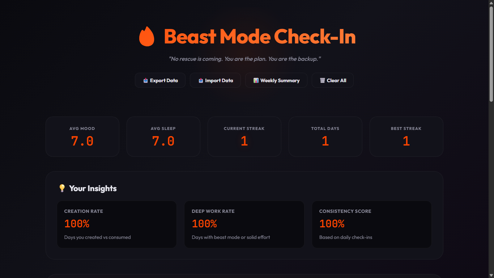
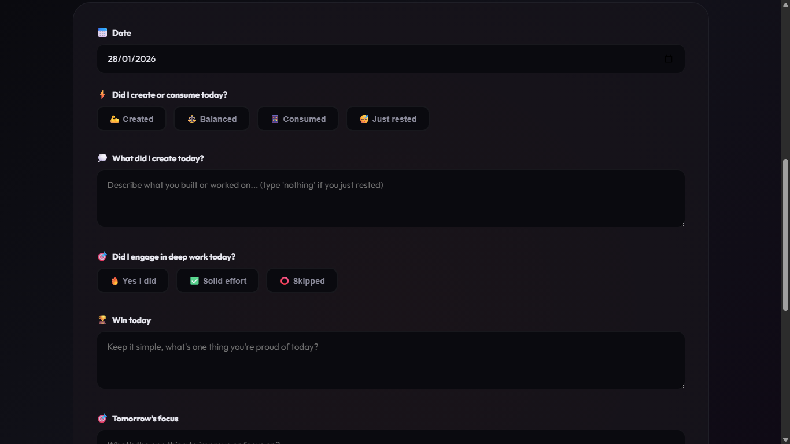

# 🔥 Beast Mode Daily Check-In

> A minimalist daily accountability tracker that helps you stay focused on what matters: creating, not consuming.

[](https://opensource.org/licenses/MIT)
[](https://github.com/Kennedy178/Daily-Check-in-Accountability-tool)

[Live Demo](https://kennedy178.github.io/Daily-Check-in-Accountability-tool/) | [Report Bug](https://github.com/Kennedy178/Daily-Check-in-Accountability-tool/issues) | [Request Feature](https://github.com/Kennedy178/Daily-Check-in-Accountability-tool/issues)

---

## 📸 Screenshots

### Dashboard Overview

*Track your daily progress with real-time statistics and insights*

### Daily Check-In Form

*Simple, intuitive interface for logging your daily activities*

### Journey History

*View your complete journey with searchable history*

---

## ✨ Features

### 🎯 Core Functionality
- **Daily Check-Ins** - Quick logging of your daily activities, mood, and sleep
- **Create vs Consume Tracking** - Monitor whether you're creating value or just consuming
- **Deep Work Monitoring** - Track your focus sessions and productivity levels
- **Streak Tracking** - Build momentum with visual streak counters
- **Smart Analytics** - Automatic calculation of creation rate, deep work rate, and consistency

### 📊 Data & Insights
- **Real-time Statistics** - Average mood, sleep hours, current & best streaks
- **Weekly Summaries** - Comprehensive 7-day performance reports
- **Historical Trends** - Search and filter through your entire journey
- **Progress Visualization** - Color-coded mood indicators and metrics

### 💾 Data Management
- **Local Storage** - All data stored securely in your browser
- **Export/Import** - JSON-based backup and restore functionality
- **Data Privacy** - Zero external tracking, 100% offline-capable

### 🎨 User Experience
- **Responsive Design** - Works seamlessly on desktop, tablet, and mobile
- **Dark Theme** - Easy on the eyes with a sleek, modern interface
- **Smooth Animations** - Polished interactions and transitions
- **Keyboard Accessible** - Full keyboard navigation support

---

## 🚀 Quick Start

### Installation

1. **Clone the repository**
   ```bash
   git clone https://github.com/Kennedy178/Daily-Check-in-Accountability-tool.git
   cd Daily-Check-in-Accountability-tool
   ```

2. **Open the app**
   ```bash
   # Simply open checkin.html in your browser
   open checkin.html
   ```

   Or use a local server:
   ```bash
   # Using Python
   python -m http.server 8000
   
   # Using Node.js
   npx serve
   ```

3. **Start tracking!**
   - Navigate to `http://localhost:8000`
   - Complete your first daily check-in
   - Watch your stats grow over time

### No Dependencies Required
This is a pure HTML/CSS/JavaScript project with zero dependencies. Just open the file and start using it!

---

## 📖 Usage Guide

### Making Your First Check-In

1. **Select the date** - Defaults to today
2. **Choose your mode** - Created, Balanced, Consumed, or Rested
3. **Describe what you created** - Brief note about your work
4. **Set your deep work status** - Beast mode, Solid effort, or Skipped
5. **Log your win** - One thing you're proud of today
6. **Set tomorrow's focus** - Your main goal for the next day
7. **Rate your mood** - Scale of 1-10
8. **Enter sleep hours** - Track your rest
9. **Save** - Your check-in is stored locally

### Understanding Your Stats

| Metric | Description |
|--------|-------------|
| **Avg Mood** | Your average mood rating across all check-ins |
| **Avg Sleep** | Your average sleep duration |
| **Current Streak** | Consecutive days with mood ≥5 and no skipped deep work |
| **Total Days** | Total number of check-ins completed |
| **Best Streak** | Your longest streak ever |
| **Creation Rate** | Percentage of days you created or stayed balanced |
| **Deep Work Rate** | Percentage of days with beast mode or solid effort |
| **Consistency Score** | How regularly you complete check-ins |

### Exporting & Importing Data

**Export:**
- Click "📥 Export Data" to download a JSON backup
- Save this file somewhere safe (e.g., cloud storage)

**Import:**
- Click "📤 Import Data"
- Paste your JSON data
- Click "Import" to restore your history

---

## 🛠️ Technical Details

### Built With
- **HTML5** - Semantic markup
- **CSS3** - Custom properties, Grid, Flexbox, animations
- **Vanilla JavaScript** - No frameworks, no build tools
- **LocalStorage API** - Client-side data persistence

### Browser Compatibility
- ✅ Chrome 90+
- ✅ Firefox 88+
- ✅ Safari 14+
- ✅ Edge 90+

### File Structure
```
Daily-Check-in-Accountability-tool/
├── checkin.html          # Main application file (self-contained)
├── screenshots/          # Screenshots for README
│   ├── dashboard.png
│   ├── form.png
│   └── history.png
├── README.md            # This file
└── LICENSE              # MIT License
```

### Data Storage Schema
```javascript
{
  date: "YYYY-MM-DD",
  createConsume: "created|balanced|consumed|rested",
  createDetails: "string",
  deepWork: "beast|solid|skip",
  smallWin: "string",
  improveTomorrow: "string",
  mood: 1-10,
  sleepHours: 0-24
}
```

---

## 🎯 Use Cases

### For Developers
- Track coding sessions and project progress
- Monitor work-life balance
- Identify productive patterns

### For Students
- Log study sessions and assignments
- Track sleep and mental health
- Build consistent study habits

### For Entrepreneurs
- Monitor daily business activities
- Track product development progress
- Maintain accountability during solo work

### For Anyone
- Build self-awareness
- Develop consistent habits
- Track personal growth over time

---

## 🤝 Contributing

Contributions are welcome! Here's how you can help:

1. **Fork the repository**
2. **Create a feature branch**
   ```bash
   git checkout -b feature/AmazingFeature
   ```
3. **Commit your changes**
   ```bash
   git commit -m 'Add some AmazingFeature'
   ```
4. **Push to the branch**
   ```bash
   git push origin feature/AmazingFeature
   ```
5. **Open a Pull Request**

### Development Guidelines
- Keep it simple - no build tools or frameworks
- Maintain accessibility standards
- Test on multiple browsers
- Update documentation as needed

---

## 🐛 Known Issues & Roadmap

### Current Limitations
- Data stored only in browser (cleared if browser data is cleared)
- No cloud sync between devices
- Limited to single-user use

### Planned Features
- [ ] Data visualization charts
- [ ] Custom habit tracking
- [ ] Goal setting and tracking
- [ ] Reminder notifications
- [ ] Mobile app version
- [ ] Multi-device sync (optional cloud storage)

See the [open issues](https://github.com/Kennedy178/Daily-Check-in-Accountability-tool/issues) for a full list of proposed features and known issues.

---

## 💡 Inspiration

This project was born from a simple truth: **what gets measured gets improved**. 

In a world of endless distractions, it's easy to spend our days consuming content rather than creating value. Beast Mode Daily Check-In helps you stay accountable to yourself, one day at a time.


---

## 📄 License

This project is licensed under the MIT License - see the [LICENSE](LICENSE) file for details.

---

## 👤 Author

**Kennedy**

- GitHub: [@Kennedy178](https://github.com/Kennedy178)
- Project Link: [Daily Check-in Accountability Tool](https://github.com/Kennedy178/Daily-Check-in-Accountability-tool)

---

## 🙏 Acknowledgments

- Font: [Outfit](https://fonts.google.com/specimen/Outfit) and [JetBrains Mono](https://fonts.google.com/specimen/JetBrains+Mono) by Google Fonts
- Design inspiration from modern productivity tools
- Built with ❤️ and a commitment to personal growth

---

## ⭐ Show Your Support

If this project helped you stay accountable and build better habits, please consider giving it a star! It helps others discover the tool and motivates continued development.

[](https://github.com/Kennedy178/Daily-Check-in-Accountability-tool)

---

<div align="center">
  <sub>Built with discipline. Maintained with consistency. Powered by accountability.</sub>
</div>
